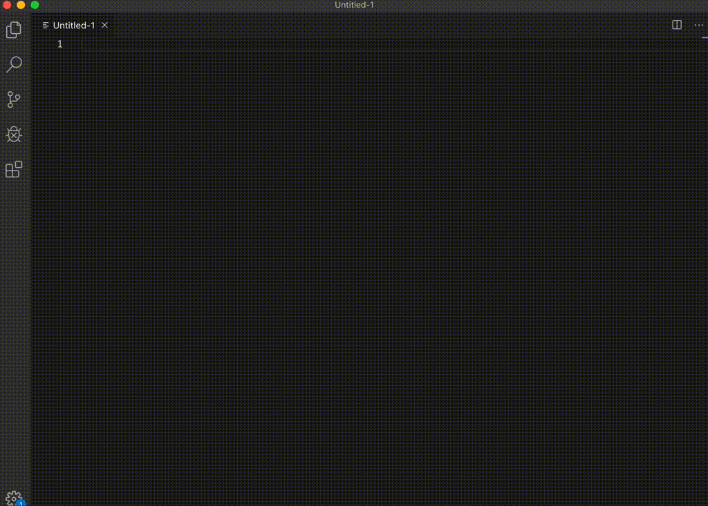

# alfred-bitwarden-workflow

AlfredからBitwardenにアクセスしてID/パスワードを入力出来るようにするためのWorkflow

ブラウザ上であれば拡張機能が用意されているが、ブラウザ外での入力補助アプリが見当たらなかったので自分用に作成

## サンプル



`Shift + Enter`でIDをアクティブウィンドウに貼り付け

`Command + Enter`でパスワードをアクティブウィンドウに貼り付け

## インストール・アンインストール

### インストール

```
# workflowをnpm経由でインストール
npm i -g https://github.com/ryou/alfred-bitwarden-workflow.git

# bitwardenにアクセスするための初期処理
alfred-bitwarden-workflow init [id] [password] [二段階認証コード]
```

### アンインストール

```
npm uninstall -g alfred-bitwarden-workflow
```
